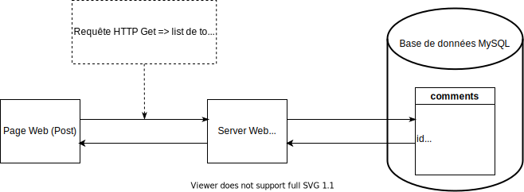

# The Green Earth Post

Ci-dessous la description de la structure du projet `The Green Earth Post`.

## Architecture 
L'image suivante présente l'architecture entre les pages Web, le back-end composé d'un serveur Web et d'une base de données MySQL



## Back-End
### Base de données
Pour des dévelopements locaux, dmarrez une base de données MySQL dans un conteneur Docker
```
docker run --name mysql \
-e MYSQL_USER=thegreenearthpost -e MYSQL_ROOT_PASSWORD=thegreenearthpost \
-e MYSQL_PASSWORD=thegreenearthpost -e MYSQL_DATABASE=thegreenearthpost \
-p 3306:3306 mysql
```

Vous pouvez l'arrêter et le supprimer avec
```
docker container stop mysql && docker container rm mysql
```

Exportez les variables d'environnement
```
export MYSQL_LOCAL_HOST="127.0.0.1"
export MYSQL_DATABASE="thegreenearthpost"
export MYSQL_USER="thegreenearthpost"
export MYSQL_PASSWORD="thegreenearthpost"
```

A noter que le champ `MYSQL_LOCAL_HOST` permet de savoir dans le code Python que la base de données est en local 

### Serveur Web
#### Requirements
- Créez un environnement virtuel `virtualenv venv && .venv/bin/activate`
- Installer les librairies Python `pip install -r back_end/requirements.txt`

#### Exécution
Exportez les variables d'environnement et exécutez le server web
```
export FLASK_APP=back_end/webserver
export FLASK_DEBUG=True
flask run
```

## Front-End
- Le dossier `front_end` contient tout le code HTML, CSS et Javascript.
- La page Web principale est `index.html`
- La page Web `post.html` est un article de presse qui contient au bas les commenteurs des visiteurs. Il est possible de poster son propre commentaire.
- Les commentaires sont stockées dans la base de données MySQL
- Pour récupérer les commentaires depuis le back-end, il faut remplacer la valeur de la variables `backEndUrl` avec l'url du serveur back-end dans le fichier `front_end/comment.js`.
