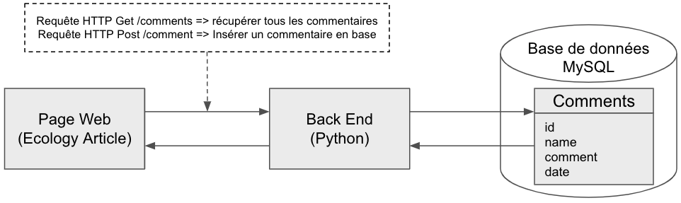
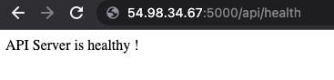

# The Green Earth Post

Ci-dessous la description de la structure du projet `The Green Earth Post`.

## Architecture 
L'image suivante présente l'architecture entre les pages Web, le back-end composé d'un serveur d'API et d'une base de données MySQL



## Structure
### Front-End
- Le dossier `front_end` contient tout le code HTML, CSS et Javascript.
- La page Web principale est `index.html`
- La page Web `post.html` est un article de presse qui contient au bas les commenteurs des visiteurs. Il est possible de poster son propre commentaire.
- Les commentaires sont stockées dans la base de données MySQL
- Pour récupérer les commentaires depuis le back-end, il faut remplacer la valeur de la variables `apiServerUrl` avec l'url du serveur d'API dans le fichier `front_end/comment.js`.

### Back-End
- Le dossier `back_end` est découpé en deux fichiers Python : 
    - `handler.py` pour traiter les requêtes HTTP
    - `db.py` pour exécuter les commandes SQL sur la base de données `MySQL`

## Développement en local (optionnel)

Pour tester en local les pages Web avec le back-end, voici la procédure à suivre : 
- [Installer Docker sur votre poste](https://openclassrooms.com/fr/courses/2035766-optimisez-votre-deploiement-en-creant-des-conteneurs-avec-docker/6211390-installez-docker-sur-votre-poste)
- Lancer une base de données MySQL dans un conteneur Docker, avec 
  - nom de base de données MySQL : `thegreenearthpost`
  - nom d'utilisateur pour se connecter à MySQL : `thegreenearthpost`
  - mot de passe pour se connecter à MySQL : `thegreenearthpost`
```
docker run --name mysql \
-e MYSQL_USER=thegreenearthpost -e MYSQL_ROOT_PASSWORD=thegreenearthpost \
-e MYSQL_PASSWORD=thegreenearthpost -e MYSQL_DATABASE=thegreenearthpost \
-p 3306:3306 mysql
```
  - Vous pouvez arrêter et supprimer le conteneur avec la commande Docker suivante
```
docker container stop mysql && docker container rm mysql
```
- Démarrez le back-end
  - Configurez les variables d'environnement suivantes :
```
export MYSQL_LOCAL_HOST="127.0.0.1" # L'url de la base de données MySQL dans le conteneur Docker
export MYSQL_DATABASE="thegreenearthpost" # nom de base de données
export MYSQL_USER="thegreenearthpost" # nom d'utilisateur pour se connecter à MySQL
export MYSQL_PASSWORD="thegreenearthpost" # mot de passe pour se connecter à MySQL
```
  - Créez un environnement virtuel `virtualenv venv && . venv/bin/activate`
  - Installer les librairies Python `pip install -r back_end/requirements.txt`
  - Exportez les variables d'environnement et exécutez le back-end
```
export FLASK_APP=back_end/handler
export FLASK_DEBUG=True
flask run
```
- Testez les pages Web
  - Le dossier `front_end` contient tout le code HTML, CSS et Javascript.
  - Pour écrire et récupérer les commentaires depuis le back-end, il faut remplacer la valeur de la variables `apiServerUrl` avec l'url du serveur d'API dans le fichier `front_end/comment.js`.
  - Consultez l'article `Agroecology Article` pour visualiser les commentaires et en écrire

## Développement sur AWS
### Installer le serveur d'API dans une instance EC2

Voici la procédure à réaliser pour installer le serveur d'API dans une instance EC2
- Créez un rôle IAM spécifique, nommé `role_serveur_api` par exemple, qui sera affecté à l'instance EC2 à créer. Il faudra mettre la politique suivante.
  Ce rôle permettra à l'instance EC2 de récupérer l'url de la base de données RDS que l'on créera par la suite.
  Cette URL ne peut pas être connue à l'avance car elle est générée automatiquement par AWS
```
{
   "Version": "2012-10-17",
   "Statement": [
      {
         "Sid": "AllowRDSDescribe",
         "Effect": "Allow",
         "Action": "rds:Describe*",
         "Resource": "*"
      }
   ]
}
```
- Créez un groupe de sécurité pour l'instance EC2, nommé `groupe_de_securite_serveur_api` par exemple, n'importe quel trafic entrant sur le port 5000


- Créez une instance EC2 avec les configurations suivantes : 
  - AMI : `Amazon Linux AMI`
  - Type d'instance : `t2.micro`
  - Rôle IAM : `role_serveur_api`
  - Configuration réseau : `VPC par défaut`
  - Groupe de sécurité : `groupe_de_securite_serveur_api`
  - (Optionnel) L'instance EC2 devra exécuter un script (ci-dessous) pour démarrer le serveur d'API. On y précise les informations sur la bases de données RDS à créer par la suite.
    - `MYSQL_DB_INSTANCE`: nom de l'instance RDS MySQL, valeur par défaut -> `thegreenearthpost`
    - `MYSQL_DATABASE`: nom de la base de données MySQL, valeur par défaut -> `thegreenearthpost`
    - `MYSQL_USER`: nom de l'utilisateur pour se connecter à la base de données, valeur par défaut -> `admin`
    - `MYSQL_PASSWORD`: mot de passe pour se connecter à la base de données avec l'utilisateur `MYSQL_USER`, valeur par défaut -> `password`
  - Données utilisateur : inclure le code ci-dessous (en modifiant les variables d'environnements si vous avez décidé de le faire)
```
#!/bin/bash
cd /home/ec2-user
sudo yum -y upgrade
sudo yum install -y git
git clone https://github.com/ysennoun/the-green-earth-post.git
pip3 install -r the-green-earth-post/back_end/requirements.txt
export AWS_DEFAULT_REGION="eu-west-1"
export MYSQL_DB_INSTANCE="thegreenearthpost"
export MYSQL_DATABASE="thegreenearthpost"
export MYSQL_USER="admin"
export MYSQL_PASSWORD="password"
gunicorn --bind 0.0.0.0:5000 --chdir the-green-earth-post/back_end handler:app

```
- Récupérez l'adresse IP de votre instance EC2 nouvellement créée
- Dans une page d'un navigateur et tapez `<instance-EC2-IP>:5000/health` ce qui permet de savoir si le serveur d'API est fonctionnel.
  Pour cela, vous devez voir le message `API Server is healthy !`, signifiant que `le Serveur d'API est en bonne santé !`


